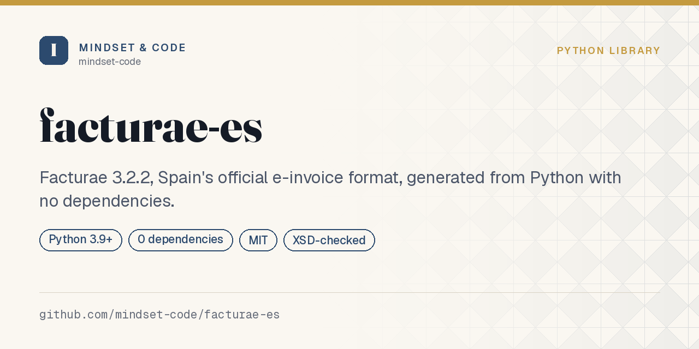

# facturae-es

**El formato oficial de factura electrónica española, generado desde Python y sin dependencias.**

[](https://github.com/mindset-code/facturae-es/actions/workflows/tests.yml)
[](https://www.python.org/)
[](LICENSE)
[](pyproject.toml)

> 🇪🇸 Español · 🇬🇧 [English version](README.md)



El Real Decreto 238/2026, de 25 de marzo
([BOE-A-2026-7295](https://www.boe.es/buscar/act.php?id=BOE-A-2026-7295)),
desarrolla la factura electrónica obligatoria entre empresarios y
profesionales. Los plazos **no se cuentan desde ese real decreto**: su
disposición final cuarta los ata a la entrada en vigor de la orden ministerial
que desarrolle la solución pública de facturación — **doce meses** después para
quien superó los 8 millones de euros de volumen de operaciones el año natural
anterior, **veinticuatro** para el resto. Arranque cuando arranque ese reloj,
mucha gente va a tener que emitir XML de Facturae. Esta biblioteca lo emite.

```python
from decimal import Decimal
from facturae_es import Direccion, Emisor, Factura, Linea, Receptor, generar

factura = Factura(
    numero="001",
    emisor=Emisor(
        nif="B12345674",
        nombre="Talleres Ejemplo SL",
        direccion=Direccion("Calle Mayor 1", "08001", "Barcelona", "Barcelona"),
    ),
    receptor=Receptor(
        nif="A58818501",
        nombre="Cliente Ejemplo SA",
        direccion=Direccion("Gran Via 100", "28013", "Madrid", "Madrid"),
    ),
    lineas=[Linea("Consultoría", cantidad=Decimal("10"), precio_unitario=Decimal("100"))],
)

factura.total          # Decimal('1210.00')
print(generar(factura))
```

## Instalación

```bash
pip install git+https://github.com/mindset-code/facturae-es
```

Python 3.9 o superior. Cero dependencias: `xml.etree.ElementTree` para el
documento y `decimal` para la aritmética. Para comprobar la instalación:

```bash
facturae-es autocomprobar
```

## Los totales se derivan, no se pasan

No hay parámetro `total=`. El total sale de las líneas, las líneas de cantidad
por precio, y la cuota de la base:

```
total = Σ líneas + Σ impuestos repercutidos − Σ retenciones
```

Una factura cuyo total no cuadra con su detalle no es un problema de redondeo
que se arregla luego: es un documento que se rechaza. Hacer el total
underivable elimina el fallo de raíz.

Todo es `Decimal`, redondeado en cada importe y no una sola vez al final, así
que `Σ líneas == total_bruto` se cumple exactamente.

## Desde la línea de órdenes

```console
$ facturae-es plantilla > factura.json     # un punto de partida ya relleno
$ facturae-es validar factura.json
Factura A001 de 2026-01-15: válida.
  Base         1250.00
  + 01 al 21% sobre 1250.00:     262.50
  - 04 al 15% sobre 1000.00:     150.00
  TOTAL        1362.50 EUR
$ facturae-es generar factura.json -o factura.xml
```

Lee `-` de la entrada estándar, así que se encadena:
`mi-erp exportar | facturae-es generar - > factura.xml`.
Referencia completa en [docs/cli.md](docs/cli.md).

## Desde un dict o un JSON

La mayoría de integraciones no tienen objetos del modelo: tienen una fila o un
payload.

```python
from facturae_es import desde_dict, desde_json, a_dict

factura = desde_json(texto)
datos = a_dict(factura)      # la vuelta reconstruye el XML idéntico
```

**Un campo mal escrito falla en vez de ignorarse.** Un `precio_unitraio` que se
descarta en silencio produce una factura de cero euros sin decir nada; esto es
lo más valioso que hace el cargador. Ver [docs/json.md](docs/json.md).

## Lo que detecta antes de emitir

Cada caso se valida al construir, con un mensaje que dice qué espera el
esquema:

- **Código postal español de cuatro dígitos.** `"8001"` es lo que una hoja de
  cálculo le hace al `"08001"` de Barcelona, y es el error de datos más común
  de todos.
- **País en alfa-2.** `ESP`, no `ES`: el esquema quiere ISO 3166-1 alfa-3.
- **Línea sin bloque de impuestos.** Si la operación está exenta, eso es
  `Impuesto(IVA, 0)` explícito: el esquema exige el bloque, y un 0 % es una
  afirmación distinta del silencio.
- **El mismo código de impuesto dos veces en una línea.** No son dos tipos, es
  un doble cómputo.
- **Persona física sin apellido.** Facturae guarda `Name` y `FirstSurname` en
  elementos separados; no hay campo de nombre completo.

## No va firmado

El XML que sale es **válido y sin firmar**. Facturae exige una firma XAdES para
presentarlo en FACe, y firmar necesita un certificado y una biblioteca de
criptografía, que no pintan nada en un formateador sin dependencias.
[docs/signing.md](docs/signing.md) explica el reparto de trabajo y qué no hacerle
a los bytes por el camino.

## Documentación

| Página | Qué hay dentro |
|---|---|
| [Getting started](docs/getting-started.md) | instalación, primera factura, por qué los totales se derivan |
| [Invoice model](docs/invoice-model.md) | partes, líneas, impuestos, cada validación y su porqué |
| [JSON format](docs/json.md) | cada campo, los floats, la ida y vuelta |
| [Command line](docs/cli.md) | cada suborden con su salida real |
| [Signing and FACe](docs/signing.md) | qué falta para presentarla, y por qué |
| [FAQ](docs/faq.md) | redondeo, dígito de control del NIF, el calendario legal |

Hay un ejemplo completo y ejecutable en
[`examples/facturacion_completa.py`](examples/facturacion_completa.py): construir
la factura, comprobar los totales, emitir el XML, releerlo para verificar lo
escrito, ida y vuelta por JSON y cinco entradas rechazadas. La suite de pruebas
lo ejecuta, así que no se pudre.

## Alcance

Genera el **documento**. No lo firma, no lo presenta y no valida contra el XSD
oficial en tiempo de ejecución: eso obligaría a empotrar o descargar el
esquema. Para la huella encadenada que VERI\*FACTU exige a los sistemas de
facturación, que es otra obligación distinta, ver
[pyverifactu-huella](https://github.com/mindset-code/pyverifactu-huella).

**No es asesoramiento legal ni fiscal.** Contrasta con las fuentes oficiales
antes de apoyar en esto una obligación real.

## Fuentes

- [Facturae](https://www.facturae.gob.es/) — formato oficial, esquemas y documentación
- [Real Decreto 238/2026, de 25 de marzo](https://www.boe.es/buscar/act.php?id=BOE-A-2026-7295) — factura electrónica obligatoria B2B
- Ley 18/2022 (Crea y Crece), que el real decreto desarrolla

## Contribuir

Ver [CONTRIBUTING.md](CONTRIBUTING.md).

```bash
git clone https://github.com/mindset-code/facturae-es
cd facturae-es
pip install -e ".[dev]"
pytest -v
```

## Licencia

MIT — ver [LICENSE](LICENSE).

---

<sub>Mantenido por <a href="https://github.com/mindset-code">Mindset &amp; Code</a>. Si necesitas
enganchar la factura electrónica a un sistema que ya está en marcha, escribe a
contacto@mindset-code.com.</sub>
